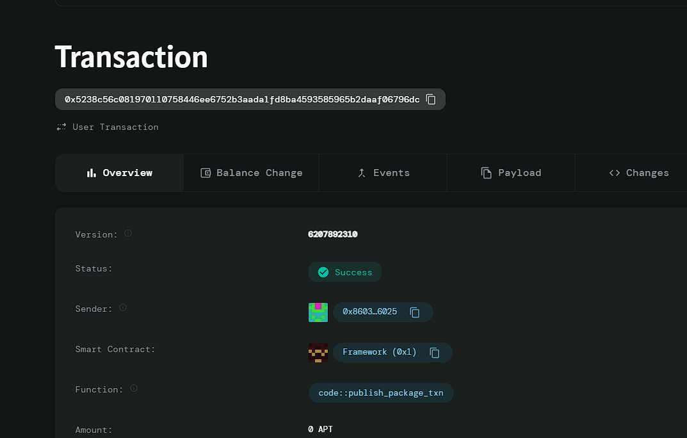

# Supply Chain Tracking

# Deployed ID: 0x5238c56c081970110758446ee6752b3aada1fd8ba4593585965b2daaf06796dc

## Project Description
A blockchain solution for tracking products throughout the supply chain, ensuring transparency and authenticity from production to delivery. Each step in the supply chain is recorded on the blockchain, enabling consumers to verify the source and journey of their products, which can help in reducing fraud and improving quality assurance.

## Project Vision
To create a transparent supply chain system that empowers consumers with the ability to track the provenance of products, ensuring trust and integrity in the marketplace.

## Key Features
- **Product Registration:** Easily register new products in the supply chain with a unique ID and initial location.
- **Location Tracking:** Update and track the location of products at each step of the supply chain, providing real-time information to stakeholders.
